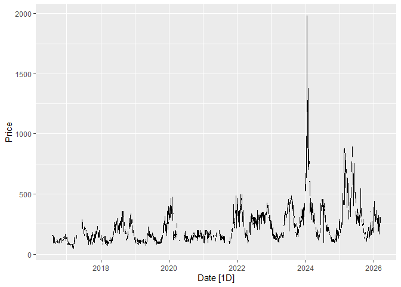
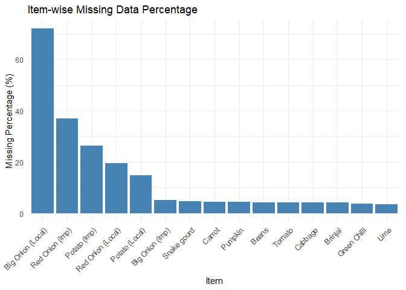
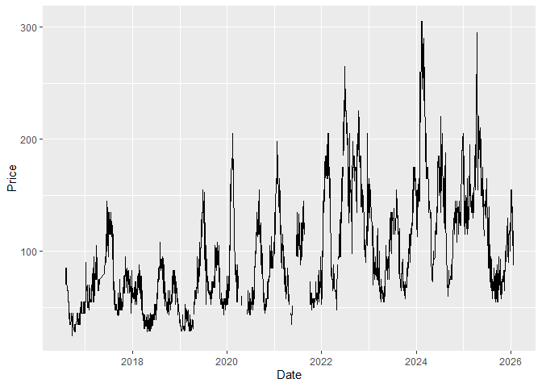

<!-- README.md is generated from README.Rmd. Please edit that file -->

# vegetablesSriLanka 

## Installation

You can install the development version of vegetablesSriLanka from
GitHub with:

``` r
# install.packages("pak")
pak::pak("thiyangt/vegetablesSriLanka")
```

## Load data

``` r
library(vegetablesSriLanka)
data("vegetables.srilanka")
head(vegetables.srilanka)
#>         Date            Item      Type   Market Price
#> 1 2016-08-01           Beans    Retail Dambulla   165
#> 2 2016-08-01           Beans    Retail   Pettah   160
#> 3 2016-08-01           Beans Wholesale Dambulla   130
#> 4 2016-08-01           Beans Wholesale   Pettah   140
#> 5 2016-08-01 Big Onion (Imp)    Retail Dambulla    80
#> 6 2016-08-01 Big Onion (Imp)    Retail   Pettah    80
tail(vegetables.srilanka)
#>              Date        Item      Type   Market Price
#> 123787 2026-01-23 Snake gourd Wholesale Dambulla   200
#> 123788 2026-01-23 Snake gourd Wholesale   Pettah   200
#> 123789 2026-01-23      Tomato    Retail Dambulla   420
#> 123790 2026-01-23      Tomato    Retail   Pettah   350
#> 123791 2026-01-23      Tomato Wholesale Dambulla   390
#> 123792 2026-01-23      Tomato Wholesale   Pettah   300
```

## Data Quality Analysis

``` r
library(visdat)
library(naniar)
library(tidyverse)
```

### Information about the class of the data input

``` r
vis_dat(vegetables.srilanka)
```



### Amount of missings in each columns

``` r
vis_miss(vegetables.srilanka)
```


### Visualise item-wise missing percentage

``` r
vs1 <- vegetables.srilanka |>
  filter(!is.na(Item)) 
gg_miss_fct(vs1, Item)
```


``` r
vs <- vegetables.srilanka |>
  filter(!is.na(Item)) |>
  select(Item, Price)
# Calculate item-wise missing percentage
missing_summary <- vs |>
  group_by(Item) |>
  summarise(
    missing_pct = mean(!complete.cases(across())) * 100
  )
#> Warning: There were 15 warnings in `summarise()`.
#> The first warning was:
#> ℹ In argument: `missing_pct = mean(!complete.cases(across())) * 100`.
#> ℹ In group 1: `Item = "Beans"`.
#> Caused by warning:
#> ! Using `across()` without supplying `.cols` was deprecated in dplyr 1.1.0.
#> ℹ Please supply `.cols` instead.
#> ℹ Run `dplyr::last_dplyr_warnings()` to see the 14 remaining warnings.

ggplot(missing_summary, aes(x = reorder(Item, -missing_pct), y = missing_pct)) +
  geom_bar(stat = "identity", fill = "steelblue") +
  labs(
    title = "Item-wise Missing Data Percentage",
    x = "Item",
    y = "Missing Percentage (%)"
  ) +
  theme_minimal() +
  theme(axis.text.x = element_text(angle = 45, hjust = 1))
```



## Example

``` r
vegetables.srilanka |>
  filter(Item == "Pumpkin") |>
  filter(Type == "Retail") |>
  filter(Market == "Dambulla") |>
  ggplot(aes(x=Date, y=Price)) + 
  geom_line()
```


