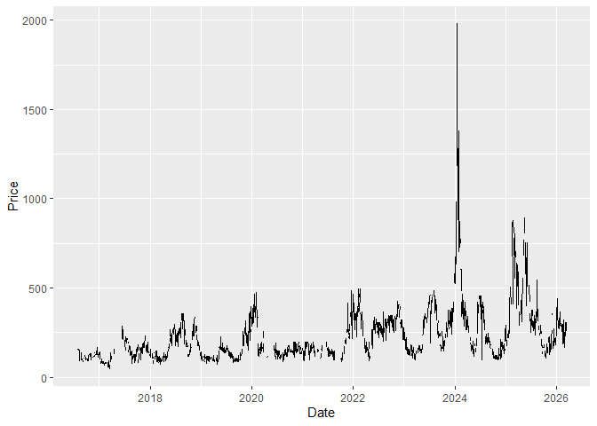
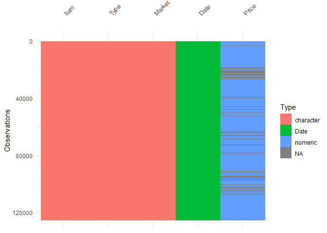
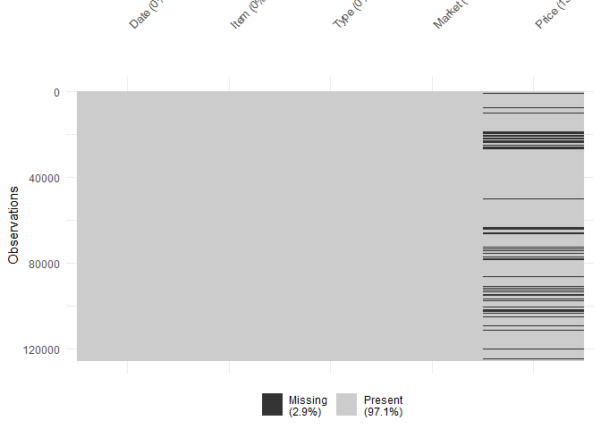
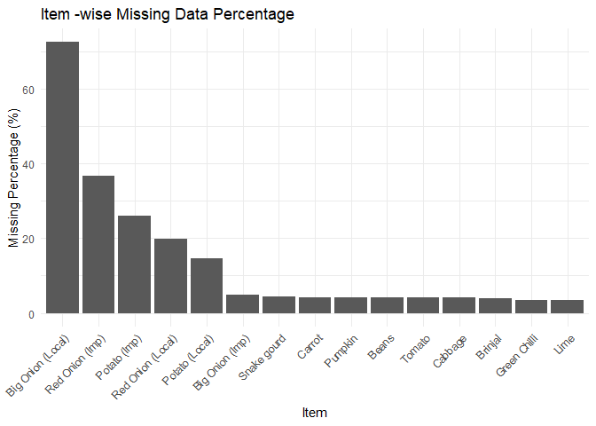

# vegetablesSriLanka

## Installation

You can install the development version of vegetablesSriLanka from
GitHub with:

``` r

# install.packages("pak")
pak::pak("thiyangt/vegetablesSriLanka")
```

## Load data

``` r

library(vegetablesSriLanka)
data("vegetables.srilanka")
head(vegetables.srilanka)
#> # A tibble: 6 × 5
#>   Date       Item  Type   Market   Price
#>   <date>     <chr> <chr>  <chr>    <dbl>
#> 1 2016-08-01 Beans Retail Dambulla   165
#> 2 2016-08-02 Beans Retail Dambulla   190
#> 3 2016-08-03 Beans Retail Dambulla   190
#> 4 2016-08-04 Beans Retail Dambulla   190
#> 5 2016-08-05 Beans Retail Dambulla   190
#> 6 2016-08-08 Beans Retail Dambulla   190
tail(vegetables.srilanka)
#> # A tibble: 6 × 5
#>   Date       Item   Type      Market Price
#>   <date>     <chr>  <chr>     <chr>  <dbl>
#> 1 2026-03-03 Tomato Wholesale Pettah   120
#> 2 2026-03-04 Tomato Wholesale Pettah   120
#> 3 2026-03-05 Tomato Wholesale Pettah    80
#> 4 2026-03-06 Tomato Wholesale Pettah    90
#> 5 2026-03-09 Tomato Wholesale Pettah   120
#> 6 2026-03-10 Tomato Wholesale Pettah   120
```

## Example

## Fill missing gaps

``` r

filled <- fillgaps_vegetable_prices(
   data = vegetables.srilanka,
   item = "Carrot",
   market = "Dambulla",
   type = "Retail"
 )
filled
#> # A tsibble: 3,509 x 5 [1D]
#>    Date       Item   Type   Market   Price
#>    <date>     <chr>  <chr>  <chr>    <dbl>
#>  1 2016-08-01 Carrot Retail Dambulla   155
#>  2 2016-08-02 Carrot Retail Dambulla   155
#>  3 2016-08-03 Carrot Retail Dambulla   150
#>  4 2016-08-04 Carrot Retail Dambulla   145
#>  5 2016-08-05 Carrot Retail Dambulla   145
#>  6 2016-08-06 <NA>   <NA>   <NA>        NA
#>  7 2016-08-07 <NA>   <NA>   <NA>        NA
#>  8 2016-08-08 Carrot Retail Dambulla   125
#>  9 2016-08-09 Carrot Retail Dambulla   135
#> 10 2016-08-10 Carrot Retail Dambulla   150
#> # ℹ 3,499 more rows
```

## Plot data

``` r

plot_vegetable_prices(
   data = vegetables.srilanka,
   item = "Carrot",
   market = "Dambulla",
   type = "Retail"
 )
```



## Data Quality Analysis

``` r

dqa <- visualize_missingness(
  data = vegetables.srilanka,
  group_var = "Item",
  target_var = "Price"
 )
dqa$data_structure
```



``` r

dqa$missing_map
```



``` r

dqa$missing_by_group
```


